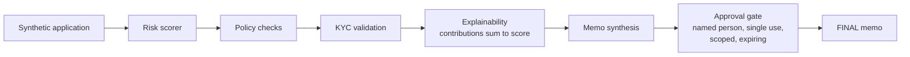
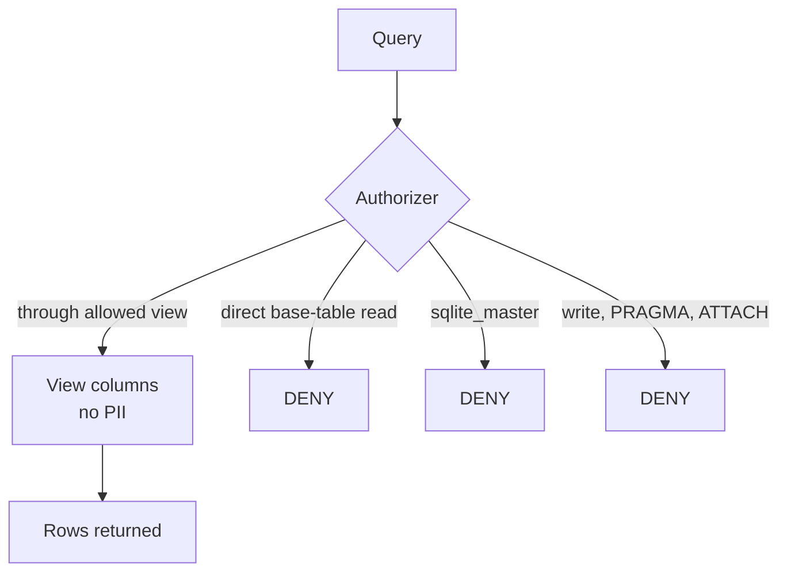
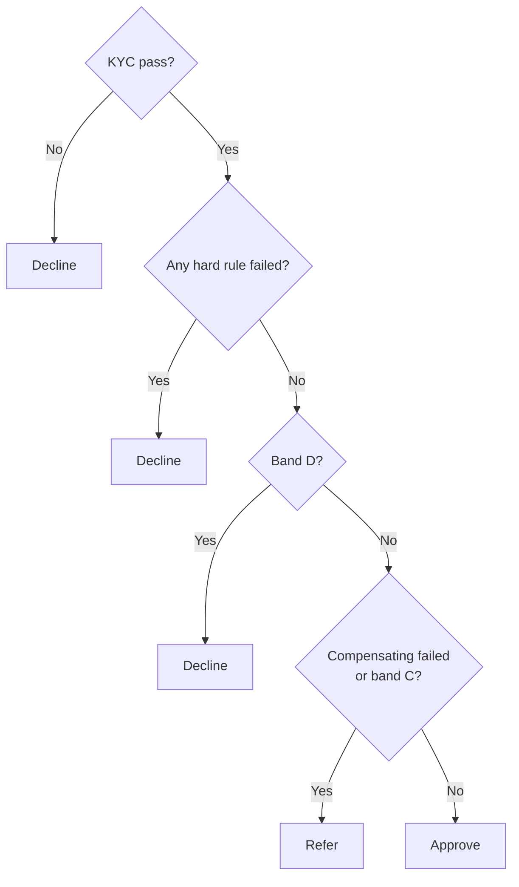

# Knowledge — architecture diagrams

## Agent pipeline

```mermaid
flowchart LR
    App[Synthetic application] --> Risk[Risk scorer]
    Risk --> Policy[Policy checks]
    Policy --> KYC[KYC validation]
    KYC --> Explain[Explainability\ncontributions sum to score]
    Explain --> Memo[Memo synthesis]
    Memo --> Gate[Approval gate\nnamed person, single use,\nscoped, expiring]
    Gate --> Final[FINAL memo]
```

## Store access

```mermaid
flowchart TB
    Q[Query] --> A{Authorizer}
    A -->|through allowed view| V[View columns\nno PII]
    A -->|direct base-table read| D1[DENY]
    A -->|sqlite_master| D2[DENY]
    A -->|write, PRAGMA, ATTACH| D3[DENY]
    V --> R[Rows returned]
```

## Decision logic

```mermaid
flowchart TB
    K{KYC pass?} -->|No| Decline1[Decline]
    K -->|Yes| H{Any hard rule failed?}
    H -->|Yes| Decline2[Decline]
    H -->|No| D{Band D?}
    D -->|Yes| Decline3[Decline]
    D -->|No| C{Compensating failed\nor band C?}
    C -->|Yes| Refer[Refer]
    C -->|No| Approve[Approve]
```
